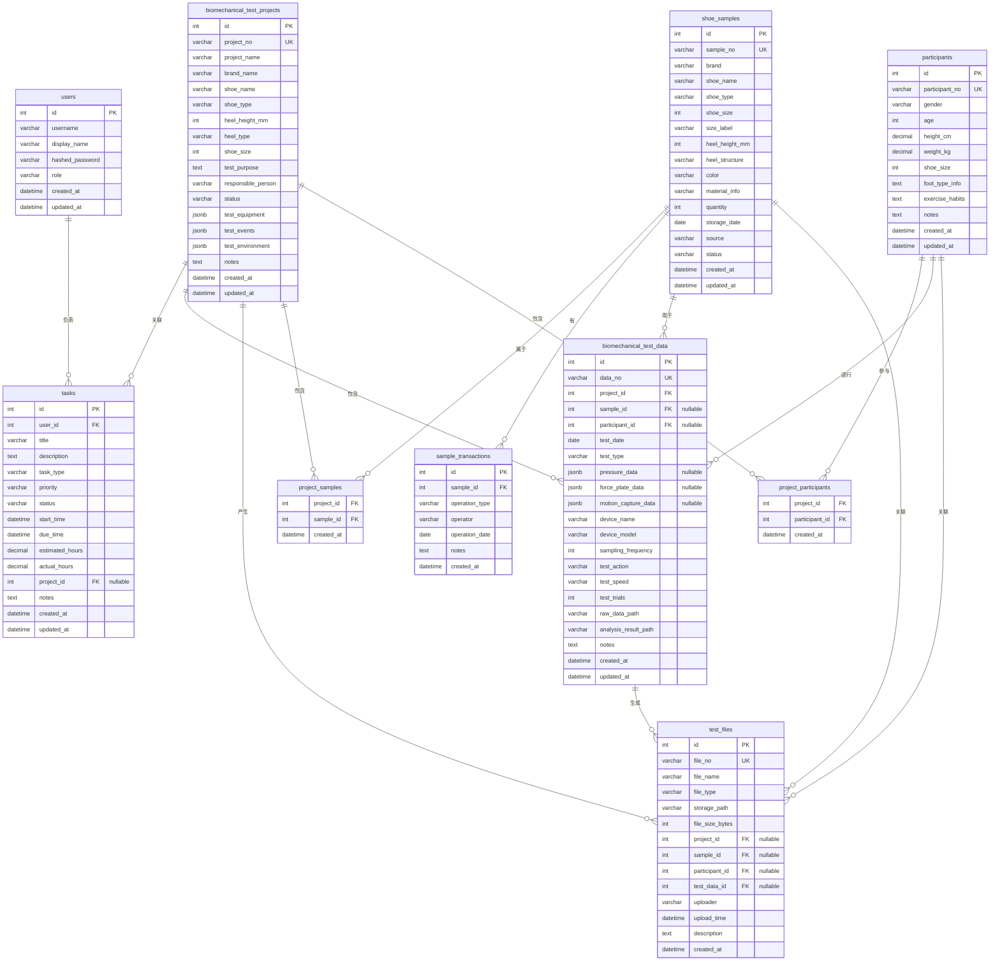

# 数据库设计文档

## 高跟鞋生物力学测试研发工作台 MVP

---

## 1. ER 图

### 1.1 核心实体关系



### 1.2 关系总结

| 主实体 | 关系 | 从实体 | 基数 |
|--------|------|--------|------|
| User | → | Task | 1:N |
| Project | → | Task | 1:N (可选) |
| Project | → | ShoeSample | M:N (通过 project_samples) |
| Project | → | Participant | M:N (通过 project_participants) |
| Project | → | TestData | 1:N |
| Project | → | TestFile | 1:N |
| ShoeSample | → | SampleTransaction | 1:N |
| ShoeSample | → | TestData | 1:N |
| ShoeSample | → | TestFile | 1:N |
| Participant | → | TestData | 1:N |
| Participant | → | TestFile | 1:N |
| TestData | → | TestFile | 1:N |

---

## 2. 数据表详细设计

### 2.1 users（用户表）

| 字段名 | 类型 | 约束 | 说明 |
|--------|------|------|------|
| id | INTEGER | PK, AUTO_INCREMENT | 主键 |
| username | VARCHAR(64) | NOT NULL, UNIQUE | 登录名 |
| display_name | VARCHAR(64) | NOT NULL | 显示名称 |
| hashed_password | VARCHAR(256) | NOT NULL | bcrypt 哈希密码 |
| role | VARCHAR(32) | DEFAULT 'engineer' | 角色：admin / engineer / viewer |
| created_at | TIMESTAMP | DEFAULT NOW() | 创建时间 |
| updated_at | TIMESTAMP | DEFAULT NOW(), ON UPDATE | 更新时间 |

### 2.2 tasks（任务表）

| 字段名 | 类型 | 约束 | 说明 |
|--------|------|------|------|
| id | INTEGER | PK, AUTO_INCREMENT | 主键 |
| user_id | INTEGER | FK → users.id | 负责人 |
| title | VARCHAR(256) | NOT NULL | 任务名称 |
| description | TEXT | | 任务描述 |
| task_type | VARCHAR(32) | NOT NULL | 类型枚举 |
| priority | VARCHAR(8) | NOT NULL | 优先级：高/中/低 |
| status | VARCHAR(16) | NOT NULL | 状态枚举 |
| start_time | TIMESTAMP | | 开始时间 |
| due_time | TIMESTAMP | | 截止时间 |
| estimated_hours | DECIMAL(6,1) | | 预计耗时（小时） |
| actual_hours | DECIMAL(6,1) | | 实际耗时（小时） |
| project_id | INTEGER | FK → projects.id, NULLABLE | 关联项目 |
| notes | TEXT | | 备注 |
| created_at | TIMESTAMP | DEFAULT NOW() | 创建时间 |
| updated_at | TIMESTAMP | DEFAULT NOW(), ON UPDATE | 更新时间 |

**类型枚举**：日常事务 / 测试准备 / 实验执行 / 数据分析 / 报告整理 / 文献学习

**状态枚举**：未开始 / 进行中 / 完成 / 延期

### 2.3 biomechanical_test_projects（测试项目表）

| 字段名 | 类型 | 约束 | 说明 |
|--------|------|------|------|
| id | INTEGER | PK, AUTO_INCREMENT | 主键 |
| project_no | VARCHAR(32) | NOT NULL, UNIQUE | 项目编号，如 HP-2026-001 |
| project_name | VARCHAR(256) | NOT NULL | 项目名称 |
| brand_name | VARCHAR(128) | | 品牌名称 |
| shoe_name | VARCHAR(256) | | 鞋款名称 |
| shoe_type | VARCHAR(32) | | 鞋类型枚举 |
| heel_height_mm | INTEGER | | 鞋跟高度(mm) |
| heel_type | VARCHAR(16) | | 鞋跟类型枚举 |
| shoe_size | INTEGER | | 鞋号 |
| test_purpose | TEXT | | 测试目的 |
| responsible_person | VARCHAR(64) | | 测试负责人 |
| status | VARCHAR(16) | NOT NULL | 状态枚举 |
| test_equipment | JSONB | | 测试设备列表 |
| test_events | JSONB | | 测试事件列表 |
| test_environment | JSONB | | 测试环境 |
| notes | TEXT | | 备注 |
| created_at | TIMESTAMP | DEFAULT NOW() | 创建时间 |
| updated_at | TIMESTAMP | DEFAULT NOW(), ON UPDATE | 更新时间 |

**鞋类型枚举**：高跟鞋 / 超高跟鞋 / 粗跟鞋 / 细跟鞋 / 坡跟鞋 / 平底鞋 / 其他

**鞋跟类型枚举**：细跟 / 粗跟 / 方跟 / 坡跟

**状态枚举**：待准备 / 样品确认 / 测试进行 / 数据处理中 / 报告整理 / 完成 / 归档

### 2.4 shoe_samples（鞋样品表）

| 字段名 | 类型 | 约束 | 说明 |
|--------|------|------|------|
| id | INTEGER | PK, AUTO_INCREMENT | 主键 |
| sample_no | VARCHAR(32) | NOT NULL, UNIQUE | 样品编号，如 SH-2026-001 |
| brand | VARCHAR(128) | | 品牌 |
| shoe_name | VARCHAR(256) | | 鞋款名称 |
| shoe_type | VARCHAR(32) | | 鞋类型枚举 |
| shoe_size | INTEGER | | 鞋号（欧码）|
| size_label | VARCHAR(16) | | 尺码标签，如 38、39 |
| heel_height_mm | INTEGER | | 鞋跟高度(mm) |
| heel_structure | VARCHAR(64) | | 鞋跟结构描述 |
| color | VARCHAR(32) | | 颜色 |
| material_info | TEXT | | 材料信息 |
| quantity | INTEGER | DEFAULT 1 | 数量（同款同码数）|
| storage_date | DATE | | 入库日期 |
| source | VARCHAR(128) | | 来源（品牌方提供/采购/其他）|
| status | VARCHAR(16) | NOT NULL | 状态枚举 |
| created_at | TIMESTAMP | DEFAULT NOW() | 创建时间 |
| updated_at | TIMESTAMP | DEFAULT NOW(), ON UPDATE | 更新时间 |

**状态枚举**：库存 / 测试中 / 归还 / 损耗 / 报废

### 2.5 sample_transactions（样品流水表）

| 字段名 | 类型 | 约束 | 说明 |
|--------|------|------|------|
| id | INTEGER | PK, AUTO_INCREMENT | 主键 |
| sample_id | INTEGER | FK → shoe_samples.id, NOT NULL | 样品ID |
| operation_type | VARCHAR(16) | NOT NULL | 操作类型枚举 |
| operator | VARCHAR(64) | | 操作人员 |
| operation_date | DATE | DEFAULT CURRENT_DATE | 操作日期 |
| notes | TEXT | | 备注 |
| created_at | TIMESTAMP | DEFAULT NOW() | 创建时间 |

**操作类型枚举**：入库 / 领用 / 测试 / 归还 / 报废

### 2.6 participants（受试者表）

| 字段名 | 类型 | 约束 | 说明 |
|--------|------|------|------|
| id | INTEGER | PK, AUTO_INCREMENT | 主键 |
| participant_no | VARCHAR(32) | NOT NULL, UNIQUE | 受试者编号，如 P-2026-001 |
| gender | VARCHAR(8) | | 性别 |
| age | INTEGER | | 年龄 |
| height_cm | DECIMAL(5,1) | | 身高(cm) |
| weight_kg | DECIMAL(5,1) | | 体重(kg) |
| shoe_size | INTEGER | | 鞋码（欧码）|
| foot_type_info | TEXT | | 足型信息 |
| exercise_habits | TEXT | | 运动习惯 |
| notes | TEXT | | 备注 |
| created_at | TIMESTAMP | DEFAULT NOW() | 创建时间 |
| updated_at | TIMESTAMP | DEFAULT NOW(), ON UPDATE | 更新时间 |

**注意**：不存储姓名、身份证号等个人身份信息，仅用编号标识。

### 2.7 biomechanical_test_data（测试数据表）

| 字段名 | 类型 | 约束 | 说明 |
|--------|------|------|------|
| id | INTEGER | PK, AUTO_INCREMENT | 主键 |
| data_no | VARCHAR(32) | NOT NULL, UNIQUE | 数据编号，如 BD-2026-001 |
| project_id | INTEGER | FK → projects.id, NOT NULL | 项目ID |
| sample_id | INTEGER | FK → shoe_samples.id | 样品ID (可为空) |
| participant_id | INTEGER | FK → participants.id | 受试者ID (可为空) |
| test_date | DATE | | 测试日期 |
| test_type | VARCHAR(32) | NOT NULL | 测试类型枚举 |
| pressure_data | JSONB | | 足底压力数据 |
| force_plate_data | JSONB | | 三维力台数据 |
| motion_capture_data | JSONB | | 动态捕捉数据 |
| device_name | VARCHAR(128) | | 设备名称 |
| device_model | VARCHAR(128) | | 设备型号 |
| sampling_frequency | INTEGER | | 采样频率(Hz) |
| test_action | VARCHAR(64) | | 测试动作 |
| test_speed | VARCHAR(32) | | 测试速度 |
| test_trials | INTEGER | | 测试次数 |
| raw_data_path | VARCHAR(512) | | 原始数据路径 |
| analysis_result_path | VARCHAR(512) | | 分析结果路径 |
| notes | TEXT | | 备注 |
| created_at | TIMESTAMP | DEFAULT NOW() | 创建时间 |
| updated_at | TIMESTAMP | DEFAULT NOW(), ON UPDATE | 更新时间 |

**测试类型枚举**：足底压力测试 / 三维力台测试 / 动态捕捉测试

**JSONB 数据结构说明（预留可扩展）**：

```json
// pressure_data 结构
{
  "peak_pressure": {"hallux": 12.5, "metatarsal": 25.3, "midfoot": 8.1, "heel": 30.2},
  "average_pressure": {"hallux": 5.2, "metatarsal": 10.1, "midfoot": 3.5, "heel": 15.8},
  "pressure_time_integral": 450.2,
  "contact_area": {"total": 98.5, "forefoot": 45.2, "heel": 32.1},
  "forefoot_pressure_ratio": 0.48,
  "heel_pressure_ratio": 0.35,
  "cop_trajectory": [[12.3, 45.6], [13.1, 44.8], ...]
}

// force_plate_data 结构
{
  "vgrf_peak": 1.8,
  "vgrf_valley": 0.6,
  "ap_force": {"braking_peak": -0.3, "propulsion_peak": 0.25},
  "ml_force": {"max_lateral": 0.08, "max_medial": 0.05},
  "impulse": {"vertical": 350.0, "ap": 25.0},
  "loading_rate": 15.2,
  "moment": {"sagittal": 2.1, "frontal": 0.8, "transverse": 0.3}
}

// motion_capture_data 结构
{
  "hip_angle": {"flexion": 35.2, "extension": -10.5, "abduction": 8.1, "adduction": -5.3},
  "knee_angle": {"flexion": 60.3, "extension": 2.1, "varus": 3.2, "valgus": -2.8},
  "ankle_angle": {"dorsiflexion": 15.2, "plantarflexion": -25.1, "inversion": 5.3, "eversion": -3.1},
  "gait_cycle": {"stance_phase_ms": 620, "swing_phase_ms": 420, "total_cycle_ms": 1040},
  "step_length": {"left_mm": 520, "right_mm": 535},
  "step_frequency": 1.92,
  "joint_trajectory": [[120.5, 85.3, 1050.2], [121.0, 86.1, 1052.5], ...]
}
```

### 2.8 test_files（测试文件表）

| 字段名 | 类型 | 约束 | 说明 |
|--------|------|------|------|
| id | INTEGER | PK, AUTO_INCREMENT | 主键 |
| file_no | VARCHAR(32) | NOT NULL, UNIQUE | 文件编号 |
| file_name | VARCHAR(256) | NOT NULL | 文件名称（含扩展名）|
| file_type | VARCHAR(32) | NOT NULL | 文件类型枚举 |
| storage_path | VARCHAR(512) | NOT NULL | 存储路径（相对 storage/）|
| file_size_bytes | BIGINT | | 文件大小(字节) |
| project_id | INTEGER | FK → projects.id | 关联项目ID |
| sample_id | INTEGER | FK → shoe_samples.id | 关联样品ID |
| participant_id | INTEGER | FK → participants.id | 关联受试者ID |
| test_data_id | INTEGER | FK → biomechanical_data.id | 关联测试数据ID |
| uploader | VARCHAR(64) | | 上传人员 |
| upload_time | TIMESTAMP | DEFAULT NOW() | 上传时间 |
| description | TEXT | | 文件描述 |
| created_at | TIMESTAMP | DEFAULT NOW() | 创建时间 |

**文件类型枚举**：图片 / 视频 / 压力图 / 运动捕捉视频 / Excel / CSV / MAT文件 / PPT / PDF / 其他

### 2.9 project_samples（项目样品关联表）

| 字段名 | 类型 | 约束 | 说明 |
|--------|------|------|------|
| project_id | INTEGER | PK, FK → projects.id | 项目ID |
| sample_id | INTEGER | PK, FK → shoe_samples.id | 样品ID |
| created_at | TIMESTAMP | DEFAULT NOW() | 关联时间 |

### 2.10 project_participants（项目受试者关联表）

| 字段名 | 类型 | 约束 | 说明 |
|--------|------|------|------|
| project_id | INTEGER | PK, FK → projects.id | 项目ID |
| participant_id | INTEGER | PK, FK → participants.id | 受试者ID |
| created_at | TIMESTAMP | DEFAULT NOW() | 关联时间 |

---

## 3. 主键与外键设计

### 3.1 主键策略

- 所有表使用 **自增整数** 作为物理主键 (`id`)
- 业务编号（如 `project_no`, `sample_no`）使用 **唯一索引** 约束，不作为外键引用
- 理由：自增主键性能好、存储小；业务编号可变且带业务含义，适合展示不适合做关联

### 3.2 外键约束

| 外键 | 来源表 | 目标表 | 级联删除 |
|------|--------|--------|----------|
| user_id | tasks | users | CASCADE |
| project_id | tasks | projects | SET NULL |
| sample_id | sample_transactions | shoe_samples | CASCADE |
| project_id | biomechanical_test_data | projects | CASCADE |
| sample_id | biomechanical_test_data | shoe_samples | SET NULL |
| participant_id | biomechanical_test_data | participants | SET NULL |
| project_id | test_files | projects | CASCADE |
| sample_id | test_files | shoe_samples | SET NULL |
| participant_id | test_files | participants | SET NULL |
| test_data_id | test_files | biomechanical_test_data | SET NULL |
| project_id | project_samples | projects | CASCADE |
| sample_id | project_samples | shoe_samples | CASCADE |
| project_id | project_participants | projects | CASCADE |
| participant_id | project_participants | participants | CASCADE |

---

## 4. 索引策略

### 4.1 唯一索引

```sql
CREATE UNIQUE INDEX idx_users_username ON users(username);
CREATE UNIQUE INDEX idx_tasks_project_no ON biomechanical_test_projects(project_no);
CREATE UNIQUE INDEX idx_samples_sample_no ON shoe_samples(sample_no);
CREATE UNIQUE INDEX idx_participants_no ON participants(participant_no);
CREATE UNIQUE INDEX idx_testdata_data_no ON biomechanical_test_data(data_no);
```

### 4.2 高频查询索引

```sql
-- 任务表
CREATE INDEX idx_tasks_user_id ON tasks(user_id);
CREATE INDEX idx_tasks_due_time ON tasks(due_time);
CREATE INDEX idx_tasks_status ON tasks(status);
CREATE INDEX idx_tasks_type ON tasks(task_type);

-- 项目表
CREATE INDEX idx_projects_status ON biomechanical_test_projects(status);
CREATE INDEX idx_projects_brand ON biomechanical_test_projects(brand_name);
CREATE INDEX idx_projects_responsible ON biomechanical_test_projects(responsible_person);

-- 样品表
CREATE INDEX idx_samples_status ON shoe_samples(status);
CREATE INDEX idx_samples_brand ON shoe_samples(brand);

-- 测试数据表
CREATE INDEX idx_testdata_project ON biomechanical_test_data(project_id);
CREATE INDEX idx_testdata_type ON biomechanical_test_data(test_type);
CREATE INDEX idx_testdata_date ON biomechanical_test_data(test_date);
CREATE INDEX idx_testdata_participant ON biomechanical_test_data(participant_id);

-- 文件表
CREATE INDEX idx_files_project ON test_files(project_id);
CREATE INDEX idx_files_type ON test_files(file_type);
CREATE INDEX idx_files_upload_time ON test_files(upload_time);
```

---

## 5. 存储目录结构

```
storage/
├── {project_no}/
│   ├── Sample_Image/          # 样品图片
│   │   ├── {sample_no}_front.jpg
│   │   └── {sample_no}_side.jpg
│   ├── Pressure_Data/         # 足底压力原始数据
│   │   ├── {data_no}.csv
│   │   └── {data_no}.xlsx
│   ├── Force_Plate_Data/      # 三维力台原始数据
│   │   ├── {data_no}.csv
│   │   └── {data_no}.mat
│   ├── Motion_Capture_Data/   # 动态捕捉原始数据
│   │   ├── {data_no}.c3d
│   │   └── {data_no}.mat
│   ├── Video/                 # 视频文件
│   │   ├── {participant_no}_walking.mp4
│   │   └── {participant_no}_stair.mp4
│   └── Report/               # 报告
│       ├── interim/
│       └── final/
│           ├── {project_no}_report.docx
│           └── {project_no}_report.pdf
├── temp/                      # 临时文件
└── archive/                   # 归档
```

---

## 6. 未来扩展预留

| 扩展方向 | 预留设计 | 说明 |
|----------|----------|------|
| 用户权限 | role 字段 | users 表已有 role 字段 |
| 数据导入 | JSONB 字段 | biomechanical_data 使用 JSONB 存储结构化的测试参数 |
| 多维分析 | JSONB 预留 | 所有 JSONB 字段可扩展新字段，无需修改表结构 |
| 对象存储 | storage_path | 文件路径设计为相对路径，可轻松迁移到 MinIO/S3 |
| 国际团队 | VARCHAR(64) | 所有字符串字段设计包容中英文 |
| 实时数据 | created_at/updated_at | 所有数据表预留时间戳字段 |
| 审计日志 | sample_transactions | 样品流水表作为审计基础，可扩展为全局审计 |
| 数据血缘 | file_path 关联 | biomechanical_data 的 raw/analysis paths 与 test_files 形成数据血缘 |
