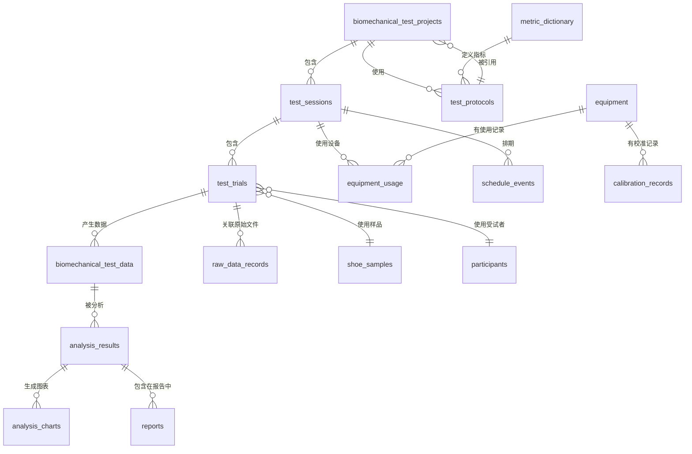

# 第二阶段架构升级方案

## 高跟鞋人体生物力学实验管理与分析平台

---

## Step 1: 第一阶段代码分析

### 1.1 可以复用的模块

| 模块 | 复用程度 | 说明 |
|------|----------|------|
| User (users) | 完全复用 | 表结构和 API 不需要改动 |
| Task (tasks) | 完全复用 | Todo 管理功能独立，不与 Phase 2 模块耦合 |
| Project (projects) | 核心复用 | 作为 Session 的上层容器，需要新增关联 |
| ShoeSample (samples) | 完全复用 | 新增 Session 关联后，样品管理逻辑不变 |
| Participant (participants) | 完全复用 | 新增 Session 关联后，受试者管理逻辑不变 |
| TestFile (files) | 大部分复用 | 文件上传/下载逻辑保留，新增与 Session/Trial 关联 |
| BiomechanicalTestData (test-data) | **需重构** | JSON 字段需要升级为规范化数据模型 |
| SampleTransaction | 完全复用 | 样品库存流水独立，无需改动 |

### 1.2 需要修改的模块

| 模块 | 修改范围 | 原因 |
|------|----------|------|
| BiomechanicalTestData | 重构 | JSON 字段 → 规范化。Raw/Standard/Analysis 三层分立 |
| Project (models) | 新增关联 | 增加与 Session、Protocol 的一对多关系 |
| TestFile | 扩展字段 | 增加 session_id、trial_id 外键 |
| Frontend Dashboard | 重写 | 从简单聚合 → 实验统计看板 |
| Frontend TestData | 重写 | 从 JSON 录入 → 规范化数据管理 |

### 1.3 无需改动的模块

- User / Task 模块：完整保留
- ShoeSample / SampleTransaction：完整保留
- Participant：完整保留
- 前端侧边菜单布局 (MainLayout)：保留，新增菜单项
- Axios API 客户端：保留

---

## Step 2: 数据库升级方案

### 2.1 新增表一览

| 表名 | 用途 | 新增模块 |
|------|------|----------|
| test_sessions | 实验 Session | 模块1 |
| test_trials | 实验试次 | 模块1 |
| test_protocols | 测试方案库 | 模块2 |
| equipment | 设备管理 | 模块3 |
| calibration_records | 校准记录 | 模块3 |
| equipment_usage | 设备使用记录 | 模块3 |
| schedule_events | 排期事件 | 模块4 |
| raw_data_records | 原始数据登记 | 模块5 |
| metric_dictionary | 生物力学指标库 | 模块6 |
| analysis_results | 分析结果 | 模块7 |
| analysis_charts | 图表 | 模块7 |
| reports | 报告中心 | 模块9 |

### 2.2 新增 ER 关系



### 2.3 新增表详细设计

#### 2.3.1 test_sessions（实验 Session）

| 字段 | 类型 | 约束 | 说明 |
|------|------|------|------|
| id | INTEGER | PK | 主键 |
| session_no | VARCHAR(32) | UNIQUE, NOT NULL | Session 编号，如 S-2026-0801-001 |
| project_id | INTEGER | FK → projects.id | 所属项目 |
| test_date | DATE | | 测试日期 |
| test_location | VARCHAR(128) | | 测试地点 |
| responsible_person | VARCHAR(64) | | 负责人 |
| status | VARCHAR(16) | DEFAULT '准备' | 准备/进行中/完成/异常 |
| notes | TEXT | | 备注 |
| created_at | TIMESTAMP | | 创建时间 |
| updated_at | TIMESTAMP | | 更新时间 |

**索引**：project_id, status, test_date

#### 2.3.2 test_trials（实验试次）

| 字段 | 类型 | 约束 | 说明 |
|------|------|------|------|
| id | INTEGER | PK | 主键 |
| trial_no | VARCHAR(16) | NOT NULL | 试次编号，如 T01 |
| session_id | INTEGER | FK → sessions.id | 所属 Session |
| sample_id | INTEGER | FK → shoe_samples.id | 使用的样品 |
| participant_id | INTEGER | FK → participants.id | 受试者 |
| test_type | VARCHAR(32) | | 测试类型枚举 |
| action_type | VARCHAR(32) | | 动作类型 |
| trial_number | INTEGER | | 试次序号 |
| is_valid | VARCHAR(16) | DEFAULT '待审核' | 待审核/有效/无效 |
| invalid_reason | VARCHAR(32) | | 无效原因 |
| notes | TEXT | | 备注 |
| created_at | TIMESTAMP | | 创建时间 |

**索引**：session_id, sample_id, participant_id, is_valid

#### 2.3.3 test_protocols（测试方案）

| 字段 | 类型 | 约束 | 说明 |
|------|------|------|------|
| id | INTEGER | PK | 主键 |
| protocol_no | VARCHAR(32) | UNIQUE | 方案编号 |
| name | VARCHAR(256) | NOT NULL | 方案名称 |
| version | VARCHAR(16) | DEFAULT '1.0' | 版本号 |
| test_purpose | TEXT | | 测试目的 |
| applicable_shoe_types | JSON | | 适用鞋型列表 |
| equipment_requirements | JSON | | 设备要求列表 |
| action_flow | JSON | | 动作流程列表 |
| metric_list | JSON | | 指标列表 |
| is_active | BOOLEAN | DEFAULT true | 是否启用 |
| created_at | TIMESTAMP | | 创建时间 |
| updated_at | TIMESTAMP | | 更新时间 |

#### 2.3.4 equipment（设备）

| 字段 | 类型 | 约束 | 说明 |
|------|------|------|------|
| id | INTEGER | PK | 主键 |
| equipment_no | VARCHAR(32) | UNIQUE | 设备编号 |
| name | VARCHAR(256) | NOT NULL | 设备名称 |
| brand | VARCHAR(128) | | 品牌 |
| model | VARCHAR(128) | | 型号 |
| sampling_frequency | INTEGER | | 最大采样频率 |
| status | VARCHAR(16) | DEFAULT '正常' | 正常/维护/校准/停用 |
| notes | TEXT | | 备注 |
| created_at | TIMESTAMP | | 创建时间 |
| updated_at | TIMESTAMP | | 更新时间 |

#### 2.3.5 calibration_records（校准记录）

| 字段 | 类型 | 约束 | 说明 |
|------|------|------|------|
| id | INTEGER | PK | 主键 |
| equipment_id | INTEGER | FK → equipment.id | 设备 |
| calibration_date | DATE | NOT NULL | 校准日期 |
| calibrator | VARCHAR(64) | | 校准人员 |
| report_file_id | INTEGER | FK → test_files.id | 校准报告文件 |
| notes | TEXT | | 备注 |
| created_at | TIMESTAMP | | 创建时间 |

#### 2.3.6 equipment_usage（设备使用记录）

| 字段 | 类型 | 约束 | 说明 |
|------|------|------|------|
| id | INTEGER | PK | 主键 |
| equipment_id | INTEGER | FK → equipment.id | 设备 |
| session_id | INTEGER | FK → test_sessions.id | 关联 Session |
| start_time | TIMESTAMP | | 开始时间 |
| end_time | TIMESTAMP | | 结束时间 |
| operator | VARCHAR(64) | | 操作人员 |
| notes | TEXT | | 备注 |
| created_at | TIMESTAMP | | 创建时间 |

#### 2.3.7 schedule_events（排期事件）

| 字段 | 类型 | 约束 | 说明 |
|------|------|------|------|
| id | INTEGER | PK | 主键 |
| session_id | INTEGER | FK → test_sessions.id | 关联 Session |
| event_type | VARCHAR(16) | | 项目/Session/设备 |
| title | VARCHAR(256) | | 事件标题 |
| start_time | TIMESTAMP | NOT NULL | 开始时间 |
| end_time | TIMESTAMP | NOT NULL | 结束时间 |
| equipment_id | INTEGER | FK → equipment.id | 冲突检测用 |
| participant_id | INTEGER | FK → participants.id | 冲突检测用 |
| sample_id | INTEGER | FK → shoe_samples.id | 冲突检测用 |
| color | VARCHAR(16) | | 显示颜色 |
| created_at | TIMESTAMP | | 创建时间 |

#### 2.3.8 raw_data_records（原始数据登记）

| 字段 | 类型 | 约束 | 说明 |
|------|------|------|------|
| id | INTEGER | PK | 主键 |
| file_name | VARCHAR(256) | NOT NULL | 文件名 |
| data_type | VARCHAR(32) | | 数据类型 |
| session_id | INTEGER | FK → test_sessions.id | 关联 Session |
| trial_id | INTEGER | FK → test_trials.id | 关联 Trial |
| equipment_id | INTEGER | FK → equipment.id | 设备 |
| sampling_frequency | INTEGER | | 采样频率 |
| file_path | VARCHAR(512) | | 文件路径 |
| file_size_bytes | BIGINT | | 文件大小 |
| import_status | VARCHAR(16) | DEFAULT '已登记' | 已登记/已导入/失败 |
| created_at | TIMESTAMP | | 创建时间 |

#### 2.3.9 metric_dictionary（生物力学指标库）

| 字段 | 类型 | 约束 | 说明 |
|------|------|------|------|
| id | INTEGER | PK | 主键 |
| metric_no | VARCHAR(32) | UNIQUE | 指标编号 |
| metric_name | VARCHAR(128) | NOT NULL | 英文名称 |
| metric_name_cn | VARCHAR(128) | | 中文名称 |
| unit | VARCHAR(32) | | 单位 |
| test_type | VARCHAR(32) | | 所属测试类型 |
| description | TEXT | | 说明 |
| created_at | TIMESTAMP | | 创建时间 |

#### 2.3.10 analysis_results（分析结果）

| 字段 | 类型 | 约束 | 说明 |
|------|------|------|------|
| id | INTEGER | PK | 主键 |
| project_id | INTEGER | FK → projects.id | 项目 |
| analysis_name | VARCHAR(256) | | 分析名称 |
| analysis_type | VARCHAR(32) | | 描述统计/鞋款比较/条件比较 |
| parameters | JSON | | 分析参数快照 |
| result_data | JSON | | 结果数据 |
| created_at | TIMESTAMP | | 创建时间 |

#### 2.3.11 reports（报告）

| 字段 | 类型 | 约束 | 说明 |
|------|------|------|------|
| id | INTEGER | PK | 主键 |
| project_id | INTEGER | FK → projects.id | 项目 |
| report_name | VARCHAR(256) | | 报告名称 |
| report_type | VARCHAR(16) | | PPTX/PDF |
| file_id | INTEGER | FK → test_files.id | 生成文件 |
| template_snapshot | JSON | | 模板快照 |
| analysis_ids | JSON | | 包含的分析 ID 列表 |
| status | VARCHAR(16) | DEFAULT '草稿' | 草稿/已生成 |
| created_at | TIMESTAMP | | 创建时间 |

---

## Step 3: 数据库迁移方案

### 3.1 迁移顺序

```
Phase 1 Tables (保留不动)
    ↓
新增: equipment + calibration_records (基础数据依赖)
    ↓
新增: test_protocols + metric_dictionary (方案和指标)
    ↓
新增: test_sessions (核心流程)
    ↓
新增: test_trials (细化流程)
    ↓
新增: equipment_usage + raw_data_records + schedule_events (关联数据)
    ↓
新增: analysis_results + reports (分析与报告)
    ↓
修改: biomechanical_test_data + test_files (扩展关联字段)
```

### 3.2 现有表修改

**biomechanical_test_data** 表：
- 保留现有所有字段（向后兼容）
- 新增 `session_id` (FK → test_sessions.id, nullable)
- 新增 `trial_id` (FK → test_trials.id, nullable)
- 保留 JSON 字段作为分析数据的存储

**test_files** 表：
- 新增 `session_id` (FK → test_sessions.id, nullable)
- 新增 `trial_id` (FK → test_trials.id, nullable)

---

## Step 4: 前端新增页面

| 路由 | 页面 | 说明 |
|------|------|------|
| /sessions | 实验 Session 管理 | 列表 + 创建/编辑 + 详情 |
| /trials | 试次管理 | 在 Session 详情内嵌入 |
| /protocols | 测试方案库 | 列表 + 版本管理 |
| /equipment | 设备管理 | 列表 + 校准记录 + 使用记录 |
| /schedule | 排期日历 | 日历视图 + 冲突检测 |
| /data-import | 数据导入 | 文件导入登记 |
| /metrics | 生物力学指标库 | 指标管理 |
| /analysis | 分析模块 | 统计分析 + 图表 |
| /reports | 报告中心 | 报告生成 |

### 菜单更新

```
首页工作台 → /
Todo任务 → /tasks
测试项目 → /projects
├── 实验Session → /sessions
│   └── 试次管理 → /sessions/:id/trials
测试方案库 → /protocols
鞋样管理 → /samples
受试者管理 → /participants
设备管理 → /equipment
测试排期 → /schedule
测试数据库 → /test-data
├── 数据导入 → /data-import
├── 指标库 → /metrics
├── 分析模块 → /analysis
├── 报告中心 → /reports
文件中心 → /files
```

---

## Step 5: 开发计划

### Phase 2-1: 数据库层面（2天）
1. 新增 Session 模型 + API + 前端页面
2. 新增 Trial 模型 + API + 前端页面
3. 新增 Protocol 模型 + API + 前端页面
4. 新增 Equipment 模型 + API + 前端页面

### Phase 2-2: 流程层面（2天）
5. Equipment Usage + Schedule 排期
6. Data Import（原始文件登记）
7. Metric Dictionary（指标库）

### Phase 2-3: 分析与报告（3天）
8. Analysis 基础统计分析
9. Report 报告中心
10. Dashboard 升级

---

## 当前服务器状态

- 后端 API: http://localhost:8000 (运行中)
- 前端页面: http://localhost:8000 (运行中)
- 演示数据: 7 任务 / 1 项目 / 3 样品 / 3 受试者 / 1 测试数据